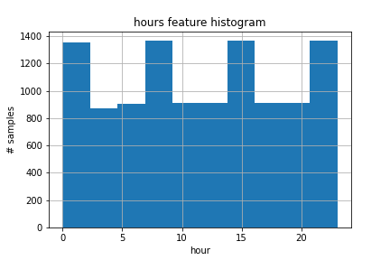
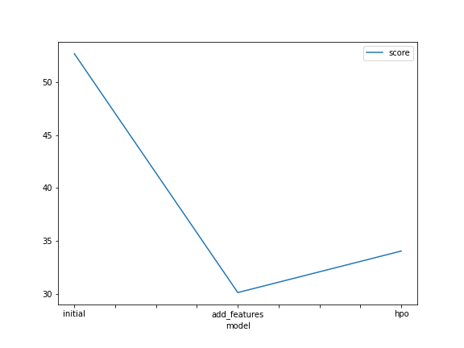
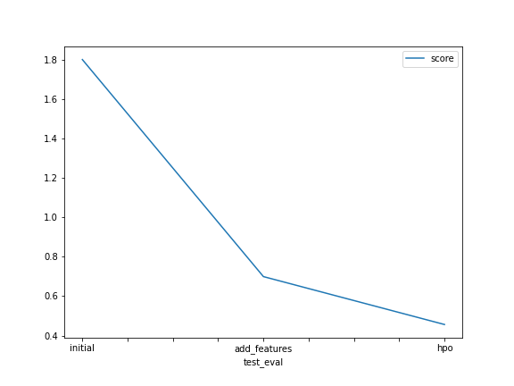

# Report: Predict Bike Sharing Demand with AutoGluon Solution
#### Mahmoud Gody

## Initial Training
### What did you realize when you tried to submit your predictions? What changes were needed to the output of the predictor to submit your results?
At the Initial phase of training, I examined the predictions to search for any negative values, but all values were positive so I
didn't need to set any values before submission to 0. I thought about converting the count column to int64 instead of float32, but according to the metric used in the competition which is root mean square logarithmic error, I think I didn't need to perform that step to the output of regression.

### What was the top ranked model that performed?
The top ranked model , i.e. the model with the lowest root mean square error (rmse), was the Weighted_Ensemble_L3 model which is basically a model formed by stacking 3 layers of the previously trained models to achieve the highest possible validation accuracy.

## Exploratory data analysis and feature creation
### What did the exploratory analysis find and how did you add additional features?
From plotting histograms at the exploratory data analysis (eda) step, I deduced that :
- some features were  binary such as [holiday, working day]
- some features were nearly normally distributed such as [temp, atemp, humidity, windspeed]
- some features were categorical such as [season, weather] it also seemed that although the data was nearly uniformly distributed among the 4 seasons, most of the data had a certain weather category (1).
- The data was nearly uniformly distributed in a monthly fashion through the years 2011, 2012 where the first 19 days of each month were used for training and the rest were used for testing and the data was recorded in different hours through out the day.

I followed the notebook suggestion of adding the **hour feature** to the data which seemed reasonable since it is a more general feature and might give the trained models more intuition to which hours of the day in general might have the largest bike share demand without specifying a certain year, month or day.

### How much better did your model perform after adding additional features and why do you think that is?
The best model's rmse decreased from 52.6 to 30.1 as a validation score which is a huge improvement also the test error (root mean square logarithmic error rmsle) decreased from 1.80346 to 0.69969 which is also a huge improvement in performance.

I think that happend because the hour feature gives the trained models better information and intuition about which hours in the day in general the bike share demand increases or decreases without specifying a certain year, month or day and according to the hour feature histogram it seems that the data was recorded nearly equally on all the hours of the day so the hour feature holds useful information.

## Hyper parameter tuning
### How much better did your model preform after trying different hyper parameters?
TODO: Add your explanation

### If you were given more time with this dataset, where do you think you would spend more time?
TODO: Add your explanation

### Create a table with the models you ran, the hyperparameters modified, and the kaggle score.
|    | model        | hpo1                                                                                                                                                                                            | hpo2                                                                                                                                                                                 | hpo3                                                                                                                                                     |   score |
|---:|:-------------|:------------------------------------------------------------------------------------------------------------------------------------------------------------------------------------------------|:-------------------------------------------------------------------------------------------------------------------------------------------------------------------------------------|:---------------------------------------------------------------------------------------------------------------------------------------------------------|--------:|
|  0 | initial      | default_vals                                                                                                                                                                                    | default_vals                                                                                                                                                                         | default_vals                                                                                                                                             | 1.80346 |
|  1 | add_features | default_vals                                                                                                                                                                                    | default_vals                                                                                                                                                                         | default_vals                                                                                                                                             | 0.69969 |
|  2 | hpo          | GBM (Light gradient boosting) : num_boost_round: [lower=100, upper=500], num_leaves:[lower=6, upper=10], learning_rate:[lower=0.01, upper=0.3, log scale], applying random search with 5 trials | XGB (XGBoost): n_estimators : [lower=100, upper=500], max_depth : [lower=6, upper=10], eta (learning_rate) : [lower=0.01, upper=0.3, log scale] applying random search with 5 trials | CAT (CATBoost) : iterations : 100, depth : [lower=6, upper=10], learning_rate  : [lower=0.01, upper=0.3, log scale] applying random search with 5 trials | 0.45605 |

### Create a line plot showing the top model score for the three (or more) training runs during the project.

TODO: Replace the image below with your own.

### Create a line plot showing the top kaggle score for the three (or more) prediction submissions during the project.

TODO: Replace the image below with your own.

## Summary
TODO: Add your explanation
